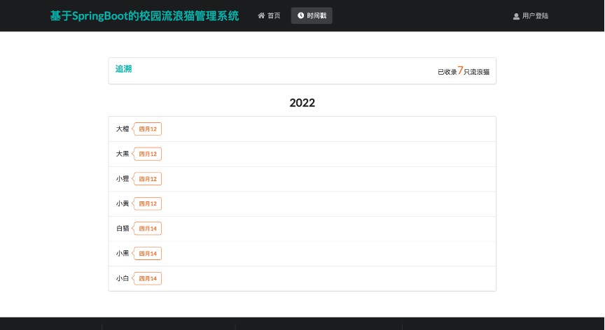

# CatHelp

基于SpringBoot的学校流浪猫信管理系统

### 功能介绍：

- 游客模块：实现没有账号的游客也能浏览流浪猫信息。
- 用户功能模块：实现了用户的注册功能，用户不仅能浏览流浪猫信息还能发布流浪猫信息，并且还能领养流浪猫。
- 管理员功能模块：可管理和修改注册用户信息的功能；管理在校流浪猫信息，可以执行增删改查操作；管理审核领养流浪猫的留言功能，执行增删改查操作；管理员可发布流浪猫信息供在线浏览的用户查看，有修改和删除的权限，可以看到每只流浪猫信息的访问量。

### 准备工作：

开发工具使用IDEA 2020.1，数据库使用MySQL8.0.27，web服务器使用Tomcat，开发环境是JDK1.8。本系统将基于SpringBoot框架开发，前端使用到CSS、Jquery、Semantic—UI。

### 配置：

- 需要填写数据库的用户名和密码；
- 配置支付宝沙箱版的公钥和私钥；
- 在catinfo-input中的文件上传功能填写相对路径。

### 界面展示

### 现存问题：

- 上传图片不完善；
- 界面简陋；
- 对上传数据不进行检测；
- ...

